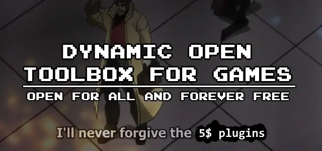

<h1 align="center">Dynamic Open Toolbox for Games</h1>

A free and open source set of RMMZ plugins. 
<i><b>🚧 Work in progress! 🚧</i></b>  
<kbd></img></kbd>

## Motivation 🙌
My friend frequently creates games using RMMZ, and while the online community for the engine is generally vibrant, there aren't enough free and open source plugins. I have made some at his request, and I'll be sharing them here after giving them some touch-ups.

## Planned features 🚀
Whatever it is that exists as a paid solution, but doesn't have a free counterpart. I'm excited to share some free and open-source alternatives to popular paid plugins. If you're interested in exploring cost-free options and contributing to the open-source community, feel free to reach out.

## Non-goals ⛔
It is not my goal to create paid plugins. I don't intend to implement every plugin request I receive. This is something I do at my leisure.

## Installation 🔧
Place the ``DotgMZ_Core.js`` plugin in your project's plugin directory, along with any other plugins you desire to use. Then register the plugins in RMMZ's plugin database. Note that the ``DotgMZ_Core`` plugin should be included before any other ``DotgMZ`` entry.
